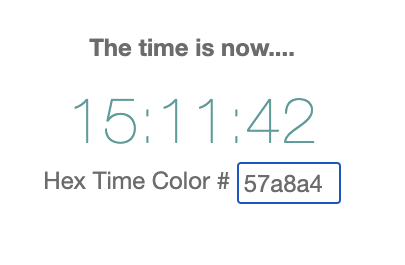

# Introduction to Web/MX

Web/MX delivers a radically more powerful yet simpler GUI developer experience, thanks to two unconventional choices:
* "reactivity first": [Matrix](https://github.com/kennytilton/matrix/blob/main/cljc/matrix/README.md) fine-grained, transparent reactivity sits at the heart of Web/MX. It drives _everything_; and
* let HTML be HTML; [MDN](https://developer.mozilla.org/en-US/docs/Web/HTML) will be your only Web/MX reference after a week.

### Why another Web framework?
Why yet another Web framework? Because [Mr. Hickey was right](https://youtu.be/2V1FtfBDsLU?t=1261): the effort of UI coding dwarfs the functionality delivered, even after decades of work producing dozens of GUI frameworks.

> "I don't do that part." -- Rich Hickey on UI coding, ClojureConj 2017

We meant well, but we have made a mess of UI programming. Every effort to improve things ended up adding another layer of cruft, another preprocessor, and a bundler to control it all. 

Web/MX took another tack, simply wrapping HTML/CSS with programmer-friendly state management. A powerful, minimalist, fun framework emerged. Rich Hickey, call your office.

### The Developer Experience
At pain of stating the obvious, the only way to grok the Web/MX Difference&trade; is to code with it. From here on we guide the reader through actual coding of a trivial web app, trivial but sufficient to cover the special qualities of Web/MX.

#### Hello Clock
Start by cloning Web/MX itself and running one of the examples. 

> In a terminal:
```bash
git clone https://github.com/kennytilton/web-mx.git
cd web-mx
clojure -M -m figwheel.main --build simpleclock --repl
```
In a minute, look for this to appear in a browser near you at [localhost:9500/simpleclock](http://localhost:9500/simpleclock.html):



The reader should be able to edit the hex color and, when it is valid, see the clock digits change to that color. Invalid values will make the field background turn pink and the digits revert to black. The curious reader will find the somewhat heavily documented [code here](https://github.com/kennytilton/web-mx/blob/main/src/tiltontec/example/simpleclock.cljs). 

Now we can return to the terminal:
> Enter ^C ^D to return to the shell prompt.

Before continuing, for convenience we can add this function to our shell startup:
```
figo () {
    echo "figwheel building and running $1"
    clojure -M -m figwheel.main --build $1 --repl
}
```
With that in hand, `figo simpleclock` in a terminal will suffice. Just make sure no other terminal has `localhost:9500` tied up.

### Baby Steps: The Intro Example
We will be modifying one of the examples, `intro.cljs`.

> In a terminal:
```bash
cd web-mx
# --EITHER--
clojure -M -m figwheel.main --build intro --repl
# --OR-- 
figo intro
```
In a minute we should see a blank (kinda) landing page at `localhost:9500/intro.html`.

> Now we need to open the `web-mx` project in our favorite ClojureScript IDE, and open `example/intro.cljs`.

Your task: Just modify some displayed text, save, and confirm you see the change in the app. 

All good? Now let us add some DOM.
##### Web/MX Syntax
Web/MX functions for generating DOM mirror the syntax of HTML. For example, where HTML has:
```html
<tag attributes*> children* </tag>
```
...Web/MX has:
```clojure
(tag [{attributes*}] children*)
```
##### Your task
* add a button just above the image;
* specify `class` as "button-2"
* the button text should be "Speak";
* when clicked it should print "Hi, mom!" in the browser console.

##### Spoiler alert!
We can complete this task by placing this code above the `(img...)`.
```bash
(button
  {:class   "button-2"
   :onclick (fn [_] (prn :hi-mom!))}
  "Speak")
```
Once you have that working, we can come back here and draw a lesson.

#### Baby Step 1 Summary
`Web/MX` wraps HTML/CSS thinly. The syntax is nearly the same, modified to accommodate Clojurescript syntax instead of Javascript. MDN is your main reference requirement. And if you already know HTML/CSS, you know most of Web/MX.

###
